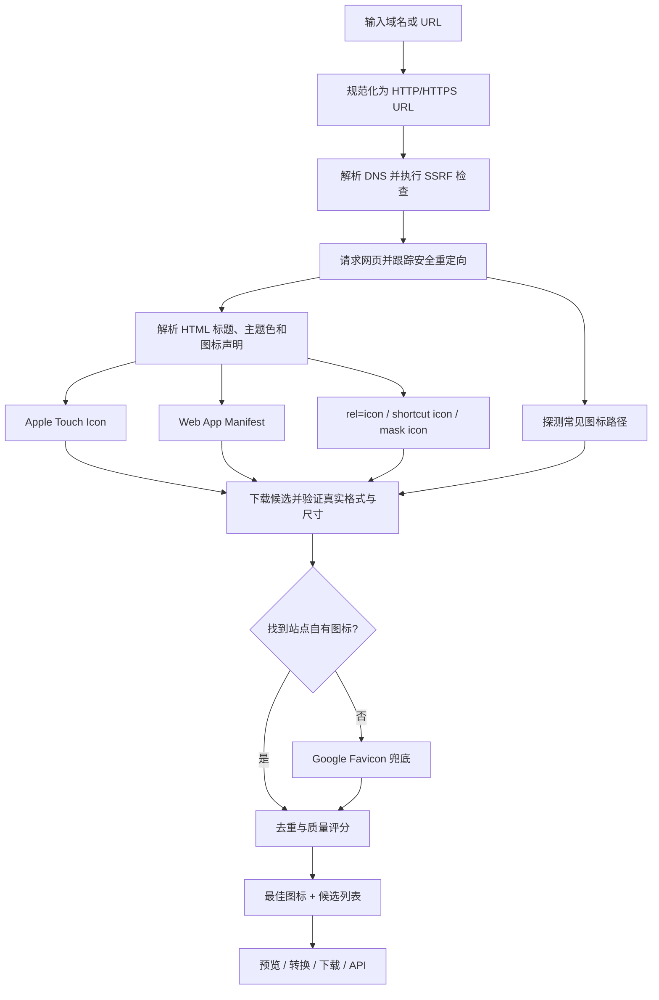

# Get Icon

[](https://hub.docker.com/r/newterry/get-icon)
[](https://hub.docker.com/r/newterry/get-icon)
[](LICENSE)

Get Icon 是一个开源的网站图标提取器。输入域名或完整 URL，它会访问目标网页，分析 HTML、Web App Manifest 和常见图标路径，验证每个候选文件的真实格式与尺寸，然后返回质量最高的 Favicon / App Icon。

它不是一个简单的 Google Favicon URL 拼接器。网站自有的 SVG、Apple Touch Icon、Manifest Icon 和普通 Favicon 始终优先，Google 只作为最后兜底。


## 功能

- 单个网站查询和最多 20 个网站的批量查询
- Apple Touch Icon、Manifest、`rel=icon`、`shortcut icon`、SVG mask icon
- 自动探测 `/favicon.ico`、`/favicon.svg`、`/apple-touch-icon.png` 等常见路径
- 读取 PNG、JPEG、WebP、AVIF、GIF、ICO 和 SVG 的真实尺寸
- 识别 ICO 内部最大图层，并支持调色板 ICO 转换
- 自动评分、URL 去重和最佳图标选择
- Original、PNG、WebP、JPEG、AVIF 格式转换及尺寸调整
- 图标预览、代理、下载、复制链接和多尺寸预览
- 中文 / English、Light / Dark / System 主题
- 无数据库、无服务端使用历史、多用户无状态运行
- 一小时内存 LRU 缓存、同 URL 请求合并、并发控制和每 IP 限速
- 完整 SSRF 防护：DNS 校验、连接 IP 固定及逐次重定向复检
- 稳定的 REST API，适合 n8n、OpenClaw 和 AI Agent
- `linux/amd64` 与 `linux/arm64` Docker 镜像

## 工作原理



### 图标发现顺序

1. `apple-touch-icon` 与 `apple-touch-icon-precomposed`
2. Web App Manifest 中的 `icons[]`
3. `icon`、`shortcut icon` 和 `mask-icon`
4. 七个常见根路径
5. Google Favicon 兜底

候选图标会被实际下载并检查，HTML 中的 `sizes` 只作为提示。SVG 因为可无损缩放获得最高质量权重；位图主要按真实像素面积排序，同时考虑来源可信度。相同 URL 只展示一次，但会保留其全部来源。

## 一键部署

### Docker Run

```bash
docker run -d --name get-icon --restart unless-stopped --init \
  -p 3080:3080 \
  -e TZ=Asia/Shanghai \
  newterry/get-icon:latest
```

打开 `http://服务器IP:3080`。

### Docker Compose

```bash
curl -O https://raw.githubusercontent.com/Newterry/get-icon/main/docker-compose.yml
docker compose up -d
```

更新：

```bash
docker compose pull
docker compose up -d
```

### Unraid 用户模板

在 Unraid 终端执行：

```bash
mkdir -p /boot/config/plugins/dockerMan/templates-user
wget -O /boot/config/plugins/dockerMan/templates-user/my-get-icon.xml \
  https://raw.githubusercontent.com/Newterry/get-icon/main/unraid/my-get-icon.xml
```

然后进入 **Docker → Add Container → User templates → get-icon**，确认端口 `3080` 后点击 **Apply**。模板直接拉取 Docker Hub 镜像，不需要 Compose Manager 或数据目录。

完整说明见 [Unraid 安装文档](unraid/README.md)。

## 环境变量

| 变量 | 默认值 | 说明 |
| --- | --- | --- |
| `PORT` | `3080` | 容器内 HTTP 端口 |
| `TZ` | `Asia/Shanghai` | 容器时区 |
| `HOST` | `0.0.0.0` | Express 监听地址 |
| `ALLOW_DNS_FAKE_IP` | `false` | 仅可信 Clash fake-IP 网络按需开启 |
| `MAX_OUTBOUND_REQUESTS` | `16` | 所有用户合计的外部请求并发上限 |
| `RATE_LIMIT_PER_MINUTE` | `180` | 每个客户端 IP 每分钟 API 请求上限 |
| `TRUST_PROXY_HOPS` | `1` | 受信任反向代理跳数 |

应用无数据库且不写入持久化数据，因此无需挂载 Volume。缓存保存在内存中，容器重启后自动清空。

## API

### 健康检查

```http
GET /api/health
```

```json
{"status":"ok"}
```

### 获取单个网站图标

```bash
curl --get "http://localhost:3080/api/icon" \
  --data-urlencode "url=https://apple.com"
```

响应包含标准化输入、最终网站 URL、网站标题、主题色、最佳图标、全部候选、来源检查和缓存信息：

```json
{
  "success": true,
  "site": {
    "inputUrl": "https://apple.com/",
    "url": "https://www.apple.com/",
    "domain": "apple.com",
    "title": "Apple",
    "themeColor": "#ffffff"
  },
  "best": {
    "url": "https://www.apple.com/apple-touch-icon.png",
    "source": "discovered",
    "sources": ["discovered"],
    "width": 152,
    "height": 152,
    "type": "image/png",
    "format": "png",
    "vector": false
  },
  "icons": [
    {
      "url": "https://www.apple.com/apple-touch-icon.png",
      "source": "discovered",
      "sources": ["discovered"],
      "width": 152,
      "height": 152,
      "type": "image/png",
      "format": "png",
      "vector": false
    }
  ],
  "checks": [],
  "resources": [],
  "meta": {"cached": false, "durationMs": 532}
}
```

### 批量获取

```bash
curl -X POST "http://localhost:3080/api/icons" \
  -H "Content-Type: application/json" \
  -d '{"urls":["apple.com","github.com","openai.com"]}'
```

一次最多 20 个 URL，服务端每批最多并发分析 4 个网站。单项失败不会中断整批响应。

### 转换图标

```bash
curl --get "http://localhost:3080/api/convert" \
  --data-urlencode "url=https://example.com/favicon.svg" \
  --data-urlencode "format=webp" \
  --data-urlencode "size=256" \
  --output icon.webp
```

- `format`：`png`、`webp`、`jpeg`、`avif`
- `size`：`16` 至 `1024`
- JPEG 使用白色背景；其他输出尽可能保留透明通道

### 代理和下载

```http
GET /api/proxy-icon?url=<encoded URL>&format=png&size=256
GET /api/download?url=<encoded URL>&domain=example.com&format=png&size=256
```

代理和下载接口都会重新执行 SSRF 防护，并拒绝无法识别的图片或超过 8 MiB 的响应。

错误响应保持统一结构：

```json
{
  "success": false,
  "error": {
    "code": "INVALID_URL",
    "message": "网址格式不正确，请输入域名或完整 URL。"
  }
}
```

## n8n 示例

在 **HTTP Request** 节点中设置：

```text
Method: GET
URL: http://get-icon:3080/api/icon
Query Parameter:
  url = {{$json.url}}
```

后续节点可以读取：

```text
{{$json.best.url}}
{{$json.best.width}}
{{$json.best.height}}
{{$json.best.type}}
{{$json.best.source}}
```

## AI Agent Tool 描述

```text
Name: get_website_icon
Description: Get the highest-quality favicon or app icon for a public website URL. The service analyzes Apple Touch Icons, Web App Manifest icons, regular favicons and common paths, using Google only as a final fallback.

Input:
- url (string, required): A website domain or full HTTP/HTTPS URL.

Returns:
- domain and final website URL
- website title and theme color when available
- best icon URL, dimensions, MIME type, format and source
- alternative icons and discovery status
```

调用端点：`GET /api/icon?url=<URL>`。

## 安全设计

Get Icon 的后端可以访问用户提供的 URL，因此所有外部请求都经过专门的 SSRF 防护：

- 只允许 HTTP 和 HTTPS；拒绝凭据型 URL
- DNS 解析后拒绝 loopback、私网、链路本地、CGNAT、组播和保留地址
- 连接固定到已经验证的 IP，降低 DNS rebinding 风险
- 每次重定向重新解析并复检目标 IP
- 网页、Manifest、图标代理和下载共享同一套安全策略
- HTML 最大 2 MiB、Manifest 最大 512 KiB、图标最大 8 MiB
- 网页默认 10 秒超时，连接、响应头和响应体都有独立超时
- API 按客户端 IP 限速，图片处理与出站访问分别限制并发

`ALLOW_DNS_FAKE_IP=true` 只适用于 Docker 主机由可信透明代理接管 `198.18.0.0/15` 的环境。公网部署不要开启。

发现安全问题请不要提交公开 Issue，请阅读 [安全策略](SECURITY.md)。

## 反向代理

前端只使用相对 API 地址，支持 Caddy、Nginx Proxy Manager 和 Cloudflare Tunnel。

```caddyfile
icon.example.com {
  reverse_proxy get-icon:3080
}
```

```nginx
location / {
    proxy_set_header Host $host;
    proxy_set_header X-Forwarded-For $proxy_add_x_forwarded_for;
    proxy_set_header X-Forwarded-Proto $scheme;
    proxy_pass http://get-icon:3080;
}
```

## 从源码开发

需要 Node.js 20.19 或更高版本。

```bash
git clone https://github.com/Newterry/get-icon.git
cd get-icon
npm install
npm run dev
```

- 前端开发地址：`http://localhost:5173`
- API 地址：`http://localhost:3080`
- Vite 会将 `/api` 代理到 Express

生产构建：

```bash
npm run lint
npm test
npm run build
docker build -t get-icon .
```

## 项目结构

```text
get-icon/
├── frontend/              # React + Vite + TypeScript
│   ├── public/
│   └── src/
│       ├── components/
│       ├── api.ts
│       ├── i18n.tsx
│       └── App.tsx
├── backend/               # Express + TypeScript
│   ├── src/
│   │   ├── extractor.ts   # HTML / Manifest / 图标提取与评分
│   │   ├── http.ts        # 超时、重定向、DNS 固定和并发控制
│   │   ├── security.ts    # URL 与 IP 安全校验
│   │   ├── image-service.ts
│   │   └── routes.ts
│   └── test/
├── unraid/
├── Dockerfile
├── docker-compose.yml
└── README.md
```

## 参与贡献

欢迎提交 Bug、功能建议和 Pull Request。开始前请阅读 [CONTRIBUTING.md](CONTRIBUTING.md)。

## License

[MIT](LICENSE) © 2026 Newterry
